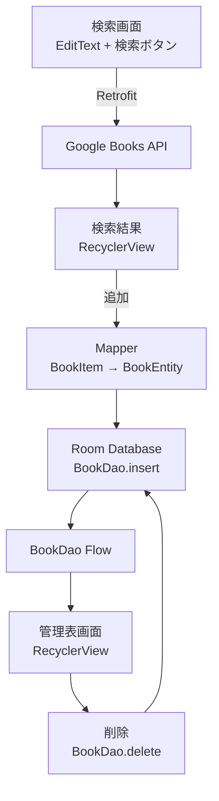

# 書籍管理アプリ(Google Books API 直叩き版)

Google Books APIと連携し、検索した本をローカルDB(Room)に保存して一覧管理するAndroidアプリです。

業務でKotlin・API連携・RecyclerView.Adapterを扱う中で改修作業が多かったため、ゼロから設計〜実装まで通しで経験する学習用途として開発しました。

> **Note**
> このバージョンは、Google Books APIキーをアプリ内に直接保持する構成です。この構成には既知の問題点があり、後継バージョンでAWS Lambda・API Gateway経由の構成に切り替えています。詳細は[APIキーに関する注意](#apiキーに関する注意)を参照してください。

---

## 目次

- [機能](#機能)
- [技術スタック](#技術スタック)
- [アーキテクチャ](#アーキテクチャ)
- [ディレクトリ構成](#ディレクトリ構成)
- [セットアップ](#セットアップ)
- [動作確認](#動作確認)
- [APIキーに関する注意](#apiキーに関する注意)
- [今後の展望](#今後の展望)

---

## 機能

### やること

- 本の管理表(一覧表示)
- 検索(Google Books API) → 選んで追加
- 一覧からの削除

### やらないこと

- 編集機能
- 絞り込み機能
- 手入力での追加(API検索経由のみ)

---

## 技術スタック

| 分類 | 技術 |
|---|---|
| 言語 | Kotlin |
| UI | RecyclerView, View Binding(`findViewById`) |
| API通信 | Retrofit + Gson |
| ローカルDB | Room(`androidx.room3`、Flow対応版) |
| 非同期処理 | Kotlin Coroutines(`lifecycleScope`, `Flow`) |
| 外部API | Google Books API(無料) |

---

## アーキテクチャ



`data`層を`local`(Room)・`remote`(API)・`mapper`(変換)・`repository`(窓口)に分割し、`ui`層からはRepositoryのみを参照する構成にしています。API層とDB層を分離することで、どちらかの実装を差し替えても他方に影響しない設計を意図しています。

---

## ディレクトリ構成

```text
com.example.myapplication/
├── data/
│   ├── local/                  ← Room関連(端末内DB)
│   │   ├── BookEntity.kt
│   │   ├── BookDao.kt
│   │   └── AppDatabase.kt
│   │
│   ├── remote/                 ← API通信関連
│   │   ├── BookApiModel.kt     (BookResponse, BookItem, VolumeInfo, ImageLinks)
│   │   ├── ApiService.kt
│   │   └── RetrofitInstance.kt
│   │
│   ├── mapper/                 ← API⇔DB間の変換処理
│   │   └── BookMapper.kt
│   │
│   └── repository/             ← Room・APIをまとめる窓口
│       └── BookRepository.kt
│
├── ui/
│   ├── list/                   ← 管理表(一覧)画面
│   │   ├── MainActivity.kt
│   │   └── BookListAdapter.kt
│   │
│   └── search/                 ← 検索・追加画面
│       ├── SearchActivity.kt
│       └── SearchResultAdapter.kt
│
└── AndroidManifest.xml
```

```text
res/layout/
├── activity_main.xml            ← ui/list (管理表画面)
├── header.xml                   ← ui/list (管理表の列見出し、includeで読み込む)
├── item_book_row.xml            ← ui/list (管理表の行)
├── activity_search.xml          ← ui/search (検索画面)
└── item_search_result.xml       ← ui/search (検索結果の行)
```

---

## セットアップ

### 1. リポジトリを取得

```bash
git clone <このリポジトリのURL>
cd <リポジトリ名>
```

### 2. Google Books APIキーを取得

[Google Cloud Console](https://console.cloud.google.com/)で、Books APIを有効化したAPIキーを発行してください。

### 3. `local.properties`にAPIキーを追加

プロジェクトルートの`local.properties`に以下を追記します(このファイルはGit管理対象外です)。

```properties
GOOGLE_BOOKS_API_KEY=取得したAPIキー
```

### 4. ビルド・実行

Android Studioでプロジェクトを開き、実行してください。`build.gradle.kts`の`buildConfigField`経由で、`local.properties`の値が`BuildConfig.GOOGLE_BOOKS_API_KEY`として読み込まれます。

---

## 動作確認

### 管理表画面

タイトル・著者・出版社・出版日の4列で管理表が表示されます。著者情報が無い本は「著者不明」と表示されます。

### 検索画面

キーワードで検索すると、Google Books APIの結果が一覧表示されます。各行の「追加」ボタンで管理表に反映されます。

---

## APIキーに関する注意

このバージョンは、Google Books APIキーを`BuildConfig`経由でアプリ内に保持し、リクエスト時に直接使用する構成です。

`local.properties`はGitの管理対象外ですが、これはソースコード管理上の秘匿性を守るものであり、**ビルド後のAPKファイルの中身までは守りません**。実際にビルドしたAPKを`jadx-gui`などの逆コンパイルツールで開くと、`BuildConfig`クラス内にAPIキーが平文の文字列として読み取れる状態で埋め込まれています。

---

## 今後の展望

- AWS Lambda・API Gateway経由でのAPI連携への切り替え(開発中)
- 横スクロール + 左列固定のテーブル表示(未着手)
- 本の表紙画像表示(未着手)